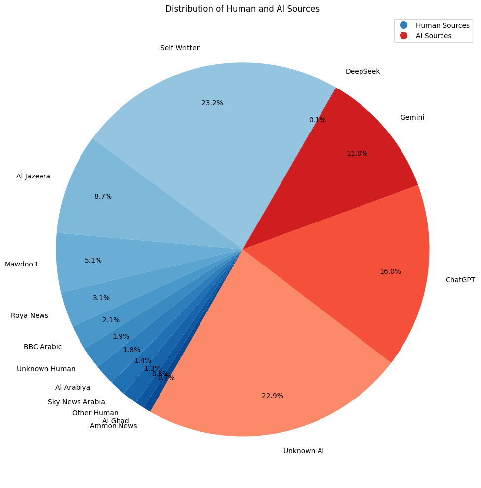
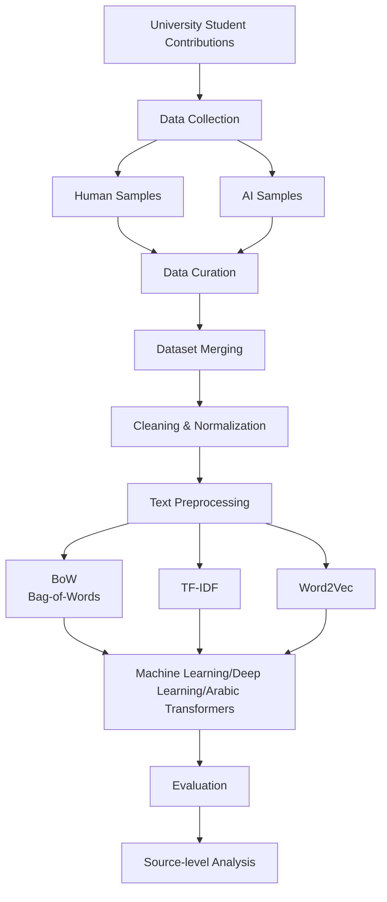
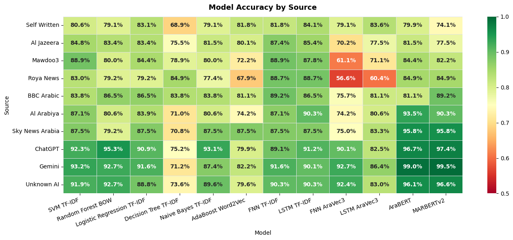

# Arabic AI Text Detection Using Machine Learning

A machine learning project for detecting whether Arabic text was written by a **human** or generated by **Artificial Intelligence (AI)**.

## Dataset

### Data Collection

The dataset was constructed using a distributed collection process in which university students contributed text samples following a common collection protocol.

For each assigned topic, a student provided:

| Type                                 | Number of samples |
| ------------------------------------ | ----------------: |
| AI-generated                         |                10 |
| Self-written                         |                 5 |
| Human-written from published sources |                 5 |
| **Total**                            |            **20** |



### Dataset Structure

The processed dataset contains the following columns:

| Column            | Description                           |
| ----------------- | ------------------------------------- |
| `text`            | Original Arabic text                  |
| `label`           | Classification label: `Human` or `AI` |
| `source`          | Original source/category of the text  |
| `text_normalized` | Normalized version of the Arabic text |

The dataset contains 1,700 valid records after the initial cleaning stage.

### Class Distribution

```
Human: 851
AI:    849
```

This gives the dataset a nearly balanced class distribution, reducing the effect of class imbalance during classification.


---

## Text Representations

Three primary representations were investigated for converting Arabic text into numerical features.

### 1. Bag-of-Words

Bag-of-Words represents each document using word-frequency counts.

The implementation uses:

* Maximum vocabulary size: 10,000
* Minimum document frequency: 2
* Maximum document frequency: 95%
* Arabic-only tokenization

The resulting representation contained **3,640 features** and had a sparse matrix shape of:

```text
(1700, 3640)
```

with approximately **2.44% density**.

### 2. TF-IDF

TF-IDF assigns higher importance to words that are distinctive within the corpus while reducing the importance of words that occur frequently across documents.

The implementation uses both:

* Unigrams
* Bigrams

and applies sublinear term-frequency scaling.

The resulting representation contained up to **10,000 features**:

```text
(1700, 10000)
```

with approximately **1.34% density**.

### 3. Word2Vec

A **Skip-Gram Word2Vec** model was trained directly on the collected corpus.

Each word is represented using a **300-dimensional vector**, and each document is represented by averaging the vectors of its words.

The resulting document representation is:

```text
(1700, 300)
```

with all 1,700 documents producing non-zero vectors.

### Representation Comparison

| Representation | Shape           | Type   |
| -------------- | --------------- | ------ |
| Bag-of-Words   | `(1700, 3640)`  | Sparse |
| TF-IDF         | `(1700, 10000)` | Sparse |
| Word2Vec       | `(1700, 300)`   | Dense  |

BoW focuses on raw word frequency, TF-IDF emphasizes distinctive terms and phrases, while Word2Vec provides dense semantic representations.

---

## Machine Learning Models

The project evaluates several approaches across the different text representations.

### Classical Machine Learning

The following classifiers were investigated:

* Support Vector Machine (SVM)
* Logistic Regression
* Random Forest
* Decision Tree
* Naive Bayes
* AdaBoost

These models were combined with representations such as TF-IDF, Bag-of-Words, and Word2Vec.

### Deep Learning

Neural-network approaches include:

* Feedforward Neural Network (FNN) + TF-IDF
* LSTM + TF-IDF
* FNN + AraVec
* LSTM + AraVec

### Transformer Models

The project also evaluates Arabic pretrained transformer models:

* **AraBERT**
* **MARBERTv2**

The evaluation pipeline compares these models alongside the classical and neural approaches.

---

## Project Pipeline

The overall workflow can be summarized as:



---


## Evaluation

Model performance is evaluated not only on the overall dataset but also according to the **source of the text**.

This is important because a detector that performs well on AI-generated text from one model may behave differently on text generated by another model or on human text from different publications.

The evaluation pipeline calculates accuracy separately for each source.

### Results

This is the Model/Data Source Matrix which shows prediction accuracy for each model on each seperate data source:




---

## Important Considerations


Each text sample has a known collection procedure and classification label. Consequently, models may potentially learn characteristics associated with the **source, collection process, topic, or generation method**, in addition to characteristics genuinely associated with human versus AI writing.

For this reason, source-level evaluation is included as an important part of the project rather than relying exclusively on a single overall accuracy score.


---

## Objectives

The main objective of this project is to compare different approaches to Arabic AI-text detection and investigate:

1. Whether classical machine-learning models can distinguish AI-generated Arabic text from human-written text.
2. How different text representations affect classification performance.
3. Whether neural networks improve upon traditional machine-learning approaches.
4. Whether Arabic-specific pretrained models such as AraBERT and MARBERTv2 provide better representations for this task.
5. How detection performance changes across different human and AI sources.